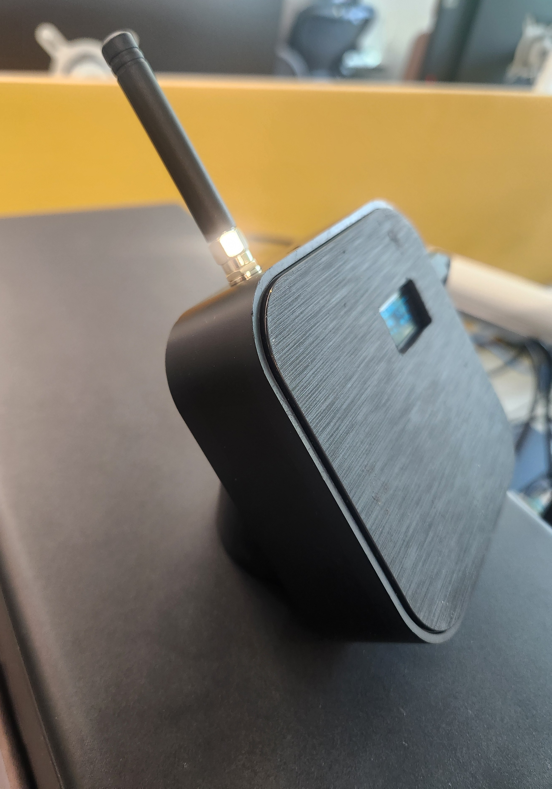
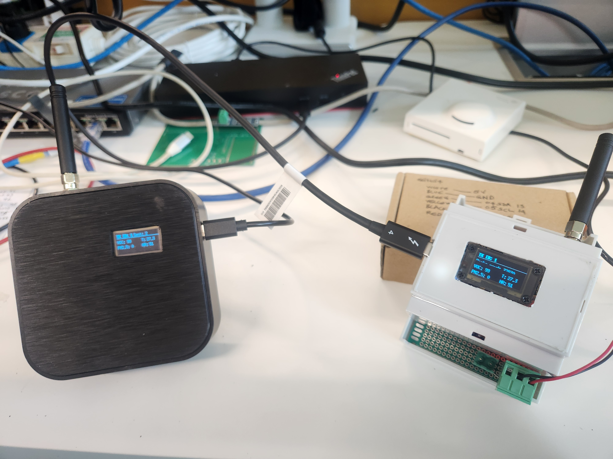

# ESP32 LoRa Room Sensor Transmitter — SEN54 / SEN56

Wireless room sensor transmitter based on the **Heltec WiFi LoRa 32 V4 (SX1262)** and a **Sensirion SEN54 environmental sensor**. The firmware uses the SEN54 command set; SEN56 compatibility is hardware-dependent and has not been independently verified here.

This project is the transmitter side of the **LoRa BACnet Gateway** located here:

https://github.com/MGuerrero31416/LoRa-BACnet-Gateway

The transmitter reads the air quality and environmental data from the sensor and sends it over LoRa to the gateway, which exposes the values through **BACnet MS/TP** for building automation integration such as Johnson Controls Metasys.

## Hardware Photos





## System Architecture

```text
SEN54
  |
  v
ESP32-S3 + SX1262
  |
  | LoRa
  v
LoRa BACnet Gateway
  |
  | RS-485 / BACnet MS/TP
  v
BACnet MS/TP
  |
  v
Building Automation System
```

## Related Project

The corresponding receiving gateway project is:

**LoRa BACnet Gateway**
https://github.com/MGuerrero31416/LoRa-BACnet-Gateway

This transmitter sends the wireless sensor payload to that gateway, which decodes the packet and exposes the values over BACnet MS/TP.

## Sensor GPIO / I2C Wiring

The current code configures a Sensirion SEN54 on the ESP32's I2C port 1:

- Sensor: Sensirion SEN54
- I2C bus: `I2C_NUM_1`
- SDA GPIO: `GPIO4`
- SCL GPIO: `GPIO6`
- I2C address: `0x69`
- Clock speed: `100000 Hz`

This is the exact hardware mapping implemented in the device firmware.

## OLED GPIO / I2C Wiring

The SSD1306 OLED uses a separate I2C bus:

- Display: SSD1306 128x64
- I2C bus: `I2C_NUM_0`
- SDA GPIO: `GPIO17`
- SCL GPIO: `GPIO18`
- I2C address: `0x3C`
- Clock speed: `400000 Hz`
- Reset GPIO: `GPIO21`
- Power-enable GPIO: `GPIO36`

## LoRa Packet

The transmitter sends a fixed 26-byte packet. All multi-byte values use little-endian byte order, and floating-point values use the ESP32's 32-bit IEEE-754 representation.

| Offset | Size | Field | Encoding |
| ---: | ---: | --- | --- |
| 0 | 1 | Protocol version | `uint8_t` |
| 1 | 4 | Device ID | `uint32_t`, little-endian |
| 5 | 4 | Sequence number | `uint32_t`, little-endian |
| 9 | 4 | Temperature | 32-bit float, little-endian |
| 13 | 4 | Relative humidity | 32-bit float, little-endian |
| 17 | 4 | PM2.5 | 32-bit float, little-endian |
| 21 | 4 | VOC index | 32-bit float, little-endian |
| 25 | 1 | Status | Bit 0 is the boot flag |

The packet fields are:

- Protocol version
- Device ID
- Sequence number
- Temperature
- Relative humidity
- PM2.5
- VOC index
- Status

The protocol includes packet validation, sequence tracking, and transmitter reboot/session handling.

## Hardware

- Heltec WiFi LoRa 32 V4
- ESP32-S3
- SX1262 LoRa transceiver
- Sensirion SEN54 / SEN56-class sensor
- SSD1306 128×64 OLED

## User Settings

Modify these settings before building and flashing the transmitter:

- Firmware revision and date: `FIRMWARE_REVISION` and `FIRMWARE_DATE` in [main/main.c](main/main.c).
- Device identifier: `DEVICE_ID` in [main/main.c](main/main.c). This must match the device identity expected by the gateway.
- Transmission interval: `TRANSMIT_PERIOD_MS` in [main/main.c](main/main.c), in milliseconds.
- LoRa frequency and transmit power: `LORA_FREQUENCY_HZ` and `LORA_TX_POWER_DBM` in [main/lora_sx1262.h](main/lora_sx1262.h). The gateway and regional radio configuration must use a compatible frequency.
- LoRa modulation: `LORA_BANDWIDTH`, `LORA_SPREADING_FACTOR`, `LORA_CODING_RATE`, and `LORA_PREAMBLE_LENGTH` in [main/lora_sx1262.h](main/lora_sx1262.h). These settings must match the gateway.
- Packet format: `TELEMETRY_PACKET_VERSION` and `TELEMETRY_PACKET_LEN` in [main/telemetry_packet.h](main/telemetry_packet.h). Changes require corresponding gateway updates.
- SEN54 I2C address and speed: `SEN54_ADDRESS` and `SEN54_I2C_FREQUENCY_HZ` in [main/sen54.h](main/sen54.h).
- OLED I2C address and speed: `OLED_ADDRESS` and `OLED_I2C_FREQUENCY_HZ` in [main/display.h](main/display.h).

Hardware pin mappings are defined in [main/lora_sx1262.c](main/lora_sx1262.c), [main/sen54.c](main/sen54.c), and [main/display.c](main/display.c).

## Current Development Status

The LoRa transmitter and BACnet gateway have been tested as a complete wireless link.

Initial development included dummy sensor data for validation before connecting the environmental sensor. The production configuration reads the SEN54 sensor and transmits the measured values to the LoRa/BACnet gateway.